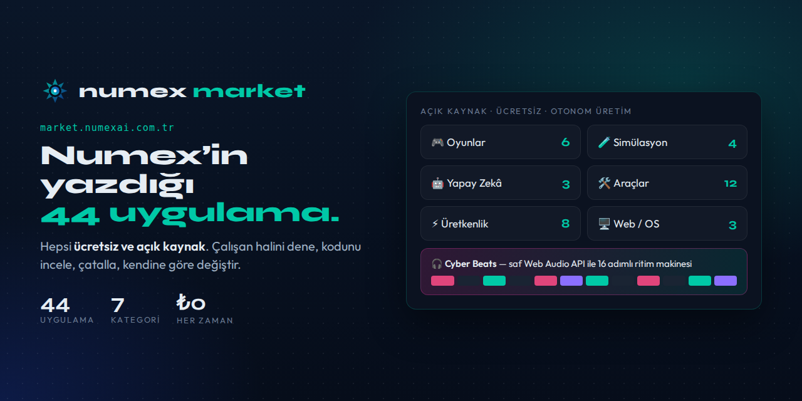
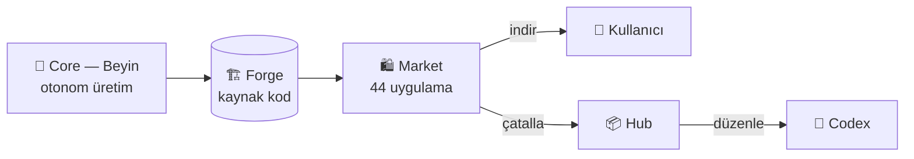

# 🛍️ Numex Market

### Numex'in kendi yazdığı 44 uygulama — hepsi ücretsiz ve açık kaynak.

---

🔗 **[market.numexai.com.tr](https://market.numexai.com.tr)** · *Açık Kaynak · Ücretsiz · Otonom Üretim*

> **Numex AI'nın sıfırdan kodladığı uygulamalar — hepsi ücretsiz ve açık kaynak.**
> İster çalışan halini indir, ister kodunu incele, ister kendine göre değiştir.

| **44** | **7** | **₺0** |
|:---:|:---:|:---:|
| Uygulama | Kategori | Her zaman ücretsiz |

## Market nedir?

Numex Market, **Numex Çekirdeği'nin otonom olarak ürettiği** uygulamaların vitrinidir. Buradaki her
uygulama bir insan tarafından tek tek kodlanmadı: Numex'e *"şunu yap"* denildi, ajan yazdı, çalıştırdı,
test etti ve [FinishGate](https://github.com/mobilcep/numex-codex/blob/main/docs/konsey.md) kanıtıyla teslim etti. Sonuç herkese açık:

- ⬇️ **İndir** — çalışan halini hemen kullan
- 👀 **İncele** — kaynak kodu [Numex Forge](https://github.com/mobilcep/numex-forge)'da açık
- 🍴 **Değiştir** — çatalla, kendine göre uyarla (Hub'da **Çatalla**)

Bu yüzden Market aynı zamanda Numex'in ne üretebildiğinin **canlı kanıtıdır**.

## Kategoriler

| Kategori | Uygulama | Ne var? |
|---|:---:|---|
| 🎮 **Oyunlar** | 6 | Tarayıcıda ve masaüstünde çalışan otonom üretilmiş oyunlar |
| 🧪 **Simülasyon** | 4 | Etkileşimli simülasyonlar ve görselleştirmeler |
| 🤖 **Yapay Zeka** | 3 | AI demoları (ör. sinir ağı çekirdeği görselleştirmesi) |
| 🛠️ **Araçlar / Yardımcı** | 12 | Kelime sayacı, resim düzenleyici, Markdown defter gibi günlük araçlar |
| ⚡ **Üretkenlik** | 8 | Randevu sistemi, depo/stok yönetimi, envanter gibi iş araçları |
| 🖥️ **Web / OS** | 3 | Web tabanlı masaüstü/işletim sistemi deneyimleri |
| 📦 **Diğer** | 8 | Ürün tanıtım sayfaları, ilan platformu ve daha fazlası |

## 🎧 Örnek: Cyber Beats

🔗 **[dene.numexai.com.tr/cyberbeats](https://dene.numexai.com.tr/cyberbeats/)**

Market uygulamaları **dene.numexai.com.tr** üzerinde kurulum gerektirmeden canlı denenebilir.
**Cyber Beats**, Numex'in otonom ürettiği tarayıcı tabanlı bir **16 adımlı ritim makinesi**:

| Özellik | Açıklama |
|---|---|
| 🥁 **4 kanal** | KICK · SNARE · HAT · SYNTH |
| 🔢 **16 adım** | Hücreye tıkla → nota ekle/çıkar; çalan adım canlı vurgulanır |
| 🎚️ **Tempo** | Kaydırıcıyla BPM ayarı (varsayılan 120) |
| ⏯️ **Kontroller** | Oynat/Duraklat (`Space`), Durdur, CLEAR |
| 🔊 **Ses motoru** | Tüm sesler **saf Web Audio API** ile sentezlenir — tek bir ses dosyası yok |
| 🎨 **Tasarım** | Neon siberpunk arayüz, durum göstergesi (● ÇALIYOR) |

Bir cümlelik istekten çalışan, test edilmiş ve yayınlanmış bir uygulamaya: Market'teki 44
uygulamanın her biri bu hattan geçti.

## Nasıl kullanılır?

1. **Keşfet** — kategori çiplerinden seç ya da *"Uygulama ara… (isim veya açıklama)"* kutusunu kullan.
2. **Kartı aç** — ekran görüntüsü, açıklama, kategori.
3. **Dene** (dene.numexai.com.tr), **İndir** ya da **Forge'a Git** → kaynak kod.
4. Beğendiysen **Hub**'da çatalla; **Codex**'te aç, *"bunu koyu temaya çevir"* de.

## Market ↔ ekosistem

Hub'ın menüsündeki **Uygulama Marketi** bağlantısı da buraya çıkar.

---

---

**Numex Ailesi** · [Numex AI](https://numexai.com.tr) · [Codex](https://github.com/mobilcep/numex-codex) · [Okul](https://github.com/mobilcep/numex-okul) · [Market](https://market.numexai.com.tr) · [Numexpedia](https://github.com/mobilcep/numex-pedia) · [Hub](https://github.com/mobilcep/numex-hub) · [Forge](https://github.com/mobilcep/numex-forge) · [API](https://github.com/mobilcep/numex-api) · [SDK](https://github.com/mobilcep/numex-sdk) · [Pusulam](https://github.com/mobilcep/pusulamx) · [PC Doktoru](https://github.com/mobilcep/pcdoktoru)

*İnsanı önce koyan Türk yapay zekâsı* 🇹🇷 · [Tüm ekosistem →](https://github.com/mobilcep/numex_nedir)

